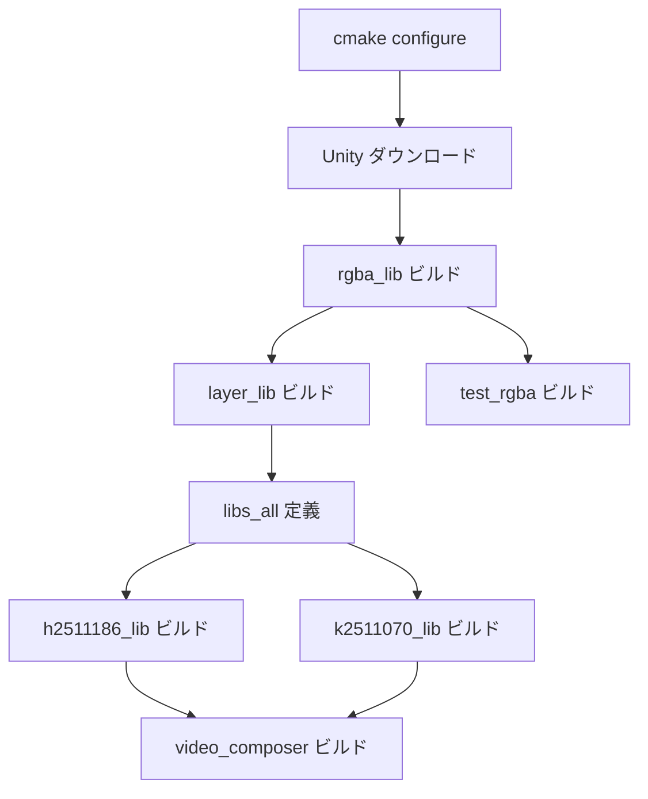

# プロジェクトアーキテクチャ

このドキュメントでは、プロジェクト全体の設計思想と構造を説明します。

## 全体像

このプロジェクトは **3層構造** で設計されています：

```
┌─────────────────────────────────────────┐
│           app (video_composer)          │  統合レイヤー
└─────────────────────┬───────────────────┘
                      │
      ┌───────────────┴───────────────┐
      ▼                               ▼
┌───────────┐                   ┌───────────┐
│ h2511186  │                   │ k2511070  │  コンポーネントレイヤー
│   _lib    │                   │   _lib    │
└─────┬─────┘                   └─────┬─────┘
      │                               │
      └───────────────┬───────────────┘
                      ▼
              ┌─────────────┐
              │  libs_all   │              基礎ライブラリレイヤー
              └──────┬──────┘
           ┌─────────┼─────────┐
           ▼         ▼         ▼
      ┌────────┐ ┌─────────┐ ┌────────┐
      │rgba_lib│ │layer_lib│ │  ...   │
      └────────┘ └─────────┘ └────────┘
```

### 各レイヤーの役割

| レイヤー | 役割 | 担当 |
|---------|------|------|
| **統合レイヤー** | コンポーネントを組み合わせて動画を生成 | 統合担当者 |
| **コンポーネントレイヤー** | 「何を描くか」を実装 | 各開発者 |
| **基礎ライブラリレイヤー** | 色やレイヤー操作などの共通機能 | ライブラリ開発者 |

---

## この構造の良いところ

### 1. 並行開発がしやすい

各開発者は自分のディレクトリ（`components/<id>/`）内で完結して作業できます。他の開発者のコードに触れる必要がないため、Git でのコンフリクトを防げます。

### 2. 基盤ライブラリの再利用

色操作やレイヤー描画は全員が使う機能です。これを共通の「基盤ライブラリ」として切り出すことで、同じコードを何度も書く必要がなくなります。

### 3. 依存関係の単純化

`libs_all` という「統合ターゲット」を用意することで、コンポーネント開発者は個別のライブラリを意識する必要がありません。`libs_all` に依存するだけで全ての基盤ライブラリが使えます。

---

## libs_all とは

`libs_all` は CMake の **INTERFACE ライブラリ** です。実体（`.a` ファイル）を持たず、他のライブラリへの依存関係をまとめる役割を果たします。

```cmake
# libs/CMakeLists.txt
add_library(libs_all INTERFACE)
target_link_libraries(libs_all
    INTERFACE
        ${PROJECT_NAME}::rgba_lib
        ${PROJECT_NAME}::layer_lib
)
```

コンポーネントは `libs_all` だけに依存すればよいので、基礎ライブラリが増えても CMakeLists.txt を変更する必要がありません。

---

## ビルドフロー

CMake がプロジェクトをビルドする順序は以下の通りです：



---

## 出力形式

最終的な動画は以下の流れで生成されます：

1. **レイヤーにフレームを描画** - `layer_lib` の関数を使用
2. **PPM 形式で連番出力** - `output/frames/frame_0000.ppm`, `frame_0001.ppm`, ...
3. **ffmpeg で GIF に変換**

```bash
# PPM 連番から GIF を生成する例
ffmpeg -framerate 30 -i output/frames/frame_%04d.ppm -filter_complex "[0:v] split [a][b]; [a] palettegen [p]; [b][p] paletteuse=diff_mode=rectangle" animation.gif
```

---

## 関連ドキュメント

- [docs/libs/rgba.md](libs/rgba.md) - rgba_lib の詳細
- [docs/libs/layer.md](libs/layer.md) - layer_lib の詳細
- [docs/cmake/conventions.md](cmake/conventions.md) - CMake 設計規約
